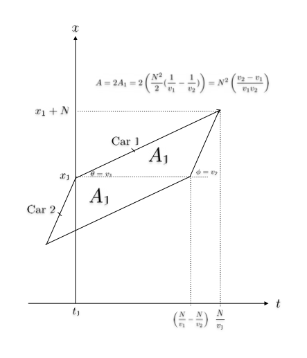

# Jane Street July 2025 Puzzle

## Description

The [July 2025 puzzle](https://www.janestreet.com/puzzles/robot-road-trip-index/) describes a two-lane, one-way, highway driven on by robot cars. 

Each car travels at a fixed speed that is a uniform random variable between $1$ and $2$ miles per minute. The fast lane of the highway is driven on by cars with minimum speed $a$ and the slow lane is driven on by cars with maximum speed $a$. 

When a faster car overtakes a slower car in the same lane, the slower car is required to decelerate to enter the slow lane if in the fast lane, or to slow to a stop on the shoulder if in the slow lane, before returning to its original speed. Cars accelerate and decelerate at a fixed speed of $1$ mile per minute, and will do so with perfect timing to prevent the overtaking car from having to change speed. Cars rarely meet on the highway, and interacting with more than one other vehicle at a time does not need to be considered. 

The highway has infinite length and cars enter the highway at uniformly distributed positions along its length at a rate of $z$ miles per minute. Each car exits the highway after completing a trip of a fixed length $N$.

Given these conditions, the puzzle asks for the value of $a$ to 10 decimal places that minimizes the expected miles not driven due to overtaking as $z \to 0+$ and $N \to \infty.$

## Solution

The solution is implemented in Python 

### Usage

```console
$ python jul2025.py
```

The script will calculate and output the required value of $a$.

## Discussion

### Overtaking costs

There are several possible interactions between cars, but for estimating the cost in miles due to overtaking, only two cases are relevant. 

1. A faster car overtakes a slower car while both are in the SLOW lane
2. A faster car overtakes a slower car while both are in the FAST lane

The cost of each interaction is straightforward to calculate. Let's call the speed of the slower car $v_1$ and the speed of the overtaking faster car $v_2$

If in the slow lane, the slower car must decelerate to a complete stop and then immediately accelerate back up to $v_1$, always changing speed at $1$ mile per minute. The cost in miles during the deceleration is equal to the cost during the acceleration, so the total cost is:

$$ 2\cdot \int_{0}^{v_1} 1x dx = 2\cdot \frac{v_1^2}{2} = v_1^2$$

If in the fast lane, the slower car must decelerate to speed $a$ in order to enter the slow lane. As with being overtaken in the slow lane, the costs of the deceleration and acceleration are equal, so the total cost in miles is:

$$ 2\cdot \int_{a}^{v_1} 1x dx = 2\cdot \frac{(v_1 - a)^2}{2} = (v_1 - a)^2$$

### Expected cost given $a$

The expected value, or in this case expected cost in miles lost, over a set of possible events occurring with random distributions is the sum of the value of each possible event multiplied by the probability of that event. In the general case for discrete events, the expected value $\mathrm{E}[X]$ over the set of events $X$ is 

$$\mathrm{E} [X] = \sum_{i} x_ip_i$$

The set of all events in our case is continuous over the uniform range of velocites and starting positions/times for cars, but only the two above overtaking events concern us, because all other events have a cost of $0$. Knowing the cost of being overtaken in either the fast or slow lane based on the variable $v_1$ and constant $a$, the probability of either event must be determined in relation to $v_1$, $v_2$ and $a$.

### Probability of overtaking

The starting position of any car is uniform over the infinite highway, which would seem to make the possibility of any two cars interacting effectively zero, especially as the rate of cars entering the highway approaches zero. It seems plausible that the probability will be some function of $N$, $z$ and the difference between $v_1$, the speed of a slower car, and $v_2$ the speed of a faster car, since if both cars have equal speed they will never interact regardless of how closely they enter the highway together in space and time.

Given a slow car with speed $v_1$ and with starting position and time $(x_1, t_1)$, the set of all possible starting positions and times $(x_2, t_2)$ for a car with speed $v_2$ which can overtake it before the slower car's trip of length $N$ ends is described in the diagram below, which is not to scale for all $v_1$, $v_2$ or $N$.



The area of this region is 

$$A_{\text{overtake}} = N^2\frac{v_2 - v_1}{v_1v_2}$$. 

The probability of an overtaking car spawning within this region is a function of $A_{overtake}$, the total available spawning area (which is infinite in position/time) and the density $z$ of cars spawning over time. The precise definition of the probability isn't necessary, but will be something like:

$$p_{overtake} = \frac{A_{\text{overtake}}\cdot z}{A_{total}}$$

$N$, $z$ and $A_{total}$ are constant for a given $z$ and $N$, so let's definite a constant $C_{N,z} = \frac{zN^2}{A_{total}}$

$$p_{overtake} = C_{N,z}\cdot\frac{v_2 - v_1}{v_1v_2}$$

This probability does not depend on $a$ and so will be the same regardless of which lane either car is in. Importantly, $C_{N,z}$ is not zero as $z \to 0+$ and $N \to \infty.$

### Calculating expected cost

Since we have definitions for the cost and probability terms of each outcome, the expected cost can be calculated symbolically. The costs of the two separate slow and fast lane overtaking events can be multiplied by the probability of an overtaking event occurring and integrated over the continuous possible values for $v_1$ and $v_2$:

$$\mathrm{E}[X(a,N,z)] = \int_{1}^{a}\int_{1}^{v_2} v_1^2 \cdot C_{N,z} \cdot \dfrac{v_2 - v_1}{v_1v_2} dv_1dv_2 + \int_{a}^{2}\int_{a}^{v_2} (v_1 - a)^2 \cdot C_{N,z} \cdot \dfrac{v_2 - v_1}{v_1v_2} dv_1dv_2$$

Via [SymPy](https://www.sympy.org/en/index.html)'s integration solver:

$$\mathrm{E}[X(a,N,z)] = C_{N,z} \left(- \frac{4 a^{3} \ln{\left(a \right)}}{3} + \frac{a^{3} \ln{\left(2 \right)}}{3} + \frac{a^{3}}{2} - 2 a^{2} \ln{\left(a \right)} - a^{2} + 2 a^{2} \ln{\left(2 \right)} - \frac{a \left(- 6 a^{2} \ln{\left(a \right)} - 3 a^{2}\right)}{6} - \frac{5 a}{2} + \frac{\ln{\left(a \right)}}{3} + \frac{8}{9} \right)$$

which has a derivative over $a$ (again via SymPy) of:

$$\frac{d}{da}\mathrm{E}[X(a,N,z)] =  C_{N,z} \left( - 3 a^{2} \ln{\left(a \right)} + \frac{2 a^{2}}{3} + a^{2} \ln{\left(2 \right)} - \frac{a \left(- 12 a \ln{\left(a \right)} - 12 a\right)}{6} - 4 a \ln{\left(a \right)} - 4 a + 4 a \ln{\left(2 \right)} - \frac{5}{2} + \frac{1}{3 a} \right)$$

To find the value of $a$ to minimize the cost given $N$ and $z$, we can find the single zero crossing of this derivative on $1 \le a \le 2$. Importantly, multiplication by the vaguely defined constant $C_{N,z} \ne 0$ will not affect the position of this crossing so we can conveniently discard it, omitting any need to include $z$ or $N$ in the calculation.

There may be a way to find the root of the remaining derivative algebraically, but evaluating it for small increments of $a$ until the zero crossing is found will find the puzzle answer to the required number of decimal places. The value of $a$ that minimizes the expected costs of overtaking is $1.1771414168$