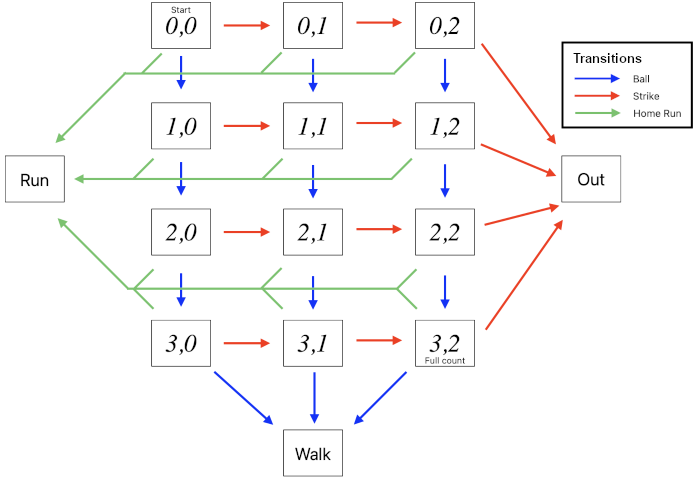

# Jane Street October 2025 Puzzle

## Description

The [October 2025 puzzle](https://www.janestreet.com/puzzles/robot-baseball-index/) asks about optimising the viewing excitement of a robot baseball league.

Robot baseball is played as a series of independent *at-bat* events, where a pitching robot and a batting robot face off, with the batter attempting to maximize the score and the pitcher attempting to minimize it. Within each at-bat, there are a series of *pitch* events. At the start of a pitch, the batter secretly chooses whether to swing or wait, and the pitcher secretly chooses whether to throw a strike or a ball. 

- If the pitcher throws a ball and the batter waits, the count of balls is incremented by 1
- If the pitcher throws a ball and the batter swings, the count of strikes is incremented by 1.
- If the pitcher throws a strike and the batter waits, the count of strikes is incremented by 1.
- If the pitcher throws a strike and the batter swings, then with probability $p$ the batter hits a home run and with probability $1-p$ the count of strikes is incremented by 1.

The at-bat ends with one of the following results.

- If the count of balls reaches 4, the score is incremented by 1.
- If the count of strikes reaches 3, the score is incremented by 0.
- If a home run occurs, the score is incremented by 4.

The value of $p$ can be adjusted by the league by modifying the size of the strike zone. To maximize viewer excitement, the league wants to maximize the probability $q$, dependent on $p$, that an at-bat reaches a *full count*, a pitch where the count of balls has reached 3 and the count of strikes has reached 2. Assuming that the batting and pitching robots are using optimal mixed strategies when choosing actions during a pitch, the puzzle asks for the maximum possible $q$ to 10 decimal places.
 
 ## Solution
 
 The solution is implemented in Python

 ### Usage

```console
$ python oct2025.py
```

 ## Discussion

### At-bat modelling

A [Markov model](https://en.wikipedia.org/wiki/Markov_model) is a useful approach to simulating the sort of stochastic process with sequential states that a robot baseball at-bat describes. In a Markov model, nodes would represent each of the distinct pitch states within the at-bat, in terms of balls and strikes accumulated, and values move from the starting 0 balls/0 strikes node to the possible outcomes based on transition probabilities between the states. This allows complicated probabilities of specific events within the system to be determined with exact precision.



Nodes for the 12 possible pitch states, plus nodes for the home run, walk and strikeout outcomes combined with transition probabilities between these nodes fully models an at-bat. Running the system forward until all outcomes are reached is simple in this case because there is no possibility of infinite loops between states; an at-bat can last for at most 6 pitches before an outcome is reached. Since we're interested in the proportion of at-bats that reach the full count state, the values that reach it during any steps when running the model can be tracked and summed.

Applying a Markov model will quickly determine the value of $q$, the probability that an at-bat reaches the full count state, for a given $p$. Varying $p$ across multiple at-bat models will then allow a search for the greatest possible $q$ to the required precision. For the approach to work, the transition probabilities between the nodes given $p$ will need to be calculated, which requires determining the strategies of the pitching and batting robots at each pitch state.

### Robot strategies

A [mixed strategy](https://en.wikipedia.org/wiki/Strategy_(game_theory)#Pure_and_mixed_strategies) in [game theory](https://en.wikipedia.org/wiki/Game_theory) is a scenario where (at least) two opposing players of a competitive game with choices between discrete actions, and specific payout values depending on outcomes of the interaction between their chosen actions, do not each have a single deterministic action that will maximize the expected value of payouts. In this case, it is optimal for each player to choose between available actions randomly, with a strategy defined by the weighted probabilities of each action that maximizes the overall expected payout value and minimises biases that the opponent could observe and exploit. The precise weighting of the strategy is dependent on the payout structure for the player and the strategy of the opposing player. Not all games have a [Nash equilibrium](https://en.wikipedia.org/wiki/Nash_equilibrium) between the strategies of the players, but fortunately a robot baseball pitch does.

Because the batter seeks to maximize the score and the pitcher seeks to minimize it, we can treat the payouts for outcomes for the pitcher as the negative of the batter payouts. Consider the following payout table given $p$ where the expected payout for a strike is $s$, the expected payout for a ball is $b$ and the expected payout for a swing at a pitch in the strike zone is $4p + s(1-p)$:

$$
\begin{matrix}
  & \text{Pitch strike} & \text{Pitch ball} \\
  \text{Swing} & (4p + s(1-p), -4p - s(1-p)) & (s, -s) \\
  \text{Wait} & (s, -s) & (b, -b)
\end{matrix}
$$

The equilibrium mixed strategies for the batter $B$ and the pitcher $P$ are given by the probability the batter swings $p_B$, the probability the batter waits $(1 - p_B)$, the probability the pitcher throws a strike $p_P$, and the probability the pitcher throws a ball $(1-p_P)$. The $p_B$ and $p_P$ terms are calculated as:

$$p_B = \frac{b - s}{4p + s(1-p) + b - 2s}$$

$$p_P = \frac{-b + s}{-4p - s(1-p) - b + 2s} = \frac{b - s}{4p + s(1-p) + b - 2s} = p_B$$

Because of the payout structure of a pitch, $p_B = p_P$ in all cases. If $4p + s(1-p) + b - 2s = 0$ then there is not a unique equilibrium for the player strategies, but this isn't possible at any pitch state.

At a full count pitch, because the at-bat will end no matter the outcome of the pitch, the table of expected payout values is the simplest to calculate. The expected payout of a ball is $1$ since that will result in a walk, and the expected payout of a strike is $0$ since that will result in a strikeout. This gives the following table of expected payouts:

$$
\begin{matrix}
  & \text{Pitch strike} & \text{Pitch ball} \\
  \text{Swing} & (4p, -4p) & (0, 0) \\
  \text{Wait} & (0, 0) & (1, -1)
\end{matrix}
$$

With the equilibrium mixed strategy given by:

$$p_B = p_P = \frac{1}{4p + 1}$$

The expected payout values of outcomes of other pitch states in the at-bat are more complicated, because the expected value of the payout of each outcome is partly dependent on the distribution of outcomes of possible subsequent pitches, which in turn depend on the equilibrium strategies of the players during those pitches. A recursive approach that propagates the solved probabilities of outcomes of subsequent states, starting from the full count state, to preceding states can successfully determine the strategies at each pitch state.

Once the strategies for each possible pitch state given $p$ are determined, it's straightforward to calculate the transition probabilities between each pitch state and so a Markov model of the at-bat can be constructed.

### Max $q$

Once an at-bat Markov model for a given $p$ can be constructed, $q$ given $p$ can be calculated by running the model forward until completion and determining the proportion of at-bats which reach the full count state. A search across $p$ in the range $(0,1)$ can be conducted until the maximum is found for $q$. 

To 10 decimal places, the maximum possible $q$ is $0.2959679934$ for $p \approx 0.2269732325$.